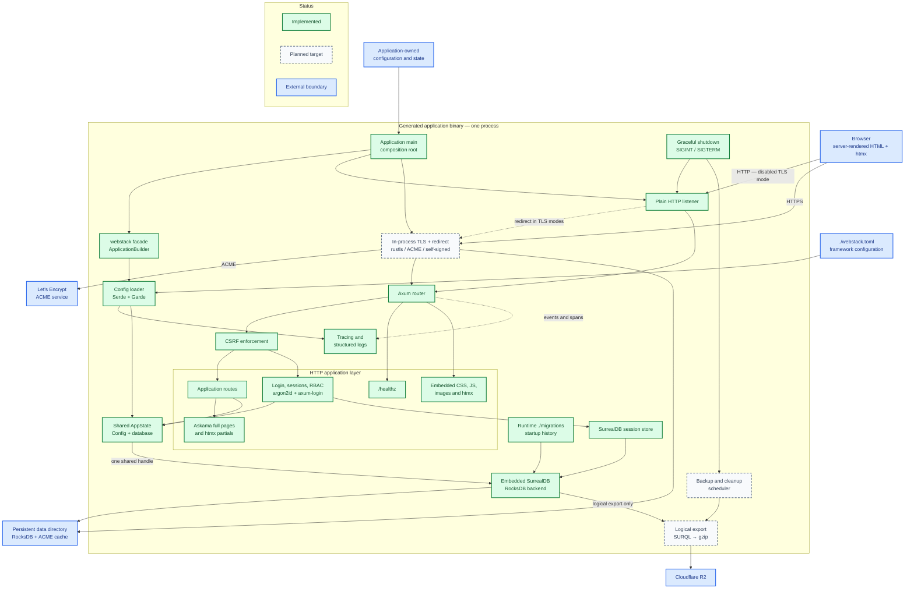

# Architecture

## Repository Role

This repository is the Webstack framework monorepo. It is not the source tree of
one production application. The `examples/demo` member exercises supported APIs,
while `webstack new` will generate independently owned application repositories.

## Boundaries

Generated applications consume the `webstack` facade. Lifecycle-independent
configuration and observability live in `webstack-core`; Axum composition,
typed state, health, and graceful shutdown live in `webstack-web`;
`webstack-db` owns the embedded connection, migration runner, and write retry
policy; `webstack-auth` owns the swappable account backend, SurrealDB session
store, CSRF checks, and route guards. The facade re-exports their supported APIs
so generated applications do not depend on internal crates.

Application routes are registered through `Application::builder().route(...)`.
The framework reserves `/healthz`; application handlers can extract
`AppState` to read the loaded Webstack configuration and clone the shared
database handle. Application-owned configuration and state remain outside the
framework configuration contract.

The `webstack-cli` package produces the `webstack` executable. CLI scaffolds will
be embedded into that executable so generation does not depend on the framework
source checkout at runtime.

## Target Application Architecture

The diagram below shows the intended complete application architecture. Solid
green components are implemented; dashed components are planned and must not be
read as current functionality. Blue components sit outside the generated
single-binary process.

## Dependency Rules

- Generated applications depend on the facade, not internal crates.
- Internal dependencies point toward core infrastructure and remain acyclic.
- The application binary is the composition root.
- Cross-feature behavior uses narrow interfaces rather than circular imports.
- All framework crates remain private until coordinated publication is designed.

## Runtime Invariants

Each generated application is one deployable binary. It creates exactly one
embedded SurrealDB instance, and every handler receives clones of that same
thread-safe handle. Assets and templates compile into release binaries. The
complete immutable migration history is deployed as `./migrations` and is
validated before HTTP binds. Live RocksDB files are never copied for backup or
opened by a second process.

## Error Boundaries

Framework libraries expose concrete, operation-specific errors derived with
`thiserror`. They retain underlying sources where useful and do not expose
`anyhow::Error` or `Box<dyn Error>` in public APIs.

Framework and generated binaries use `anyhow` to attach process-level context at
startup and command boundaries. HTTP behavior uses Webstack's typed `AppError`,
re-exported through the facade, so status codes and htmx responses remain
explicit and testable. Internal sources are logged before the application-owned
renderer receives an `ErrorView` containing only safe display data.

Framework libraries emit structured events and spans with `tracing`. Generated
application binaries install the process-global subscriber through
`webstack::observability`; libraries never install subscribers themselves. CLI
subscriber ownership remains in the `webstack` binary.
